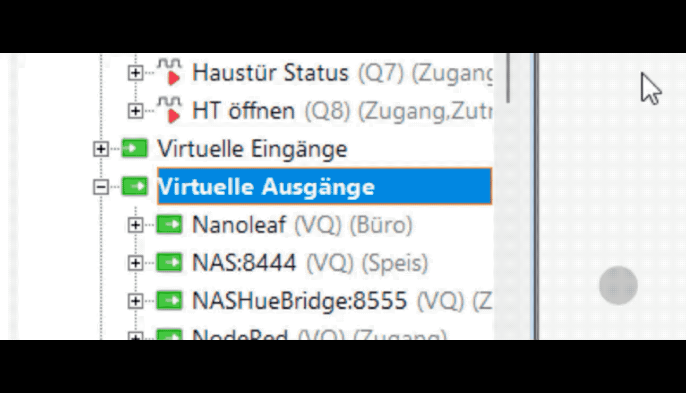

# loxHueBridge 🇦🇹

[](https://www.buymeacoffee.com/bausi2k)

**loxHueBridge** ist eine bidirektionale Schnittstelle zwischen dem **Loxone Miniserver** und der **Philips Hue Bridge (V2 / API)**.

Sie ermöglicht eine extrem schnelle, lokale Steuerung ohne Cloud-Verzögerung und nutzt die moderne Hue Event-Schnittstelle (SSE), um Statusänderungen (Bewegung, Temperatur, externe Schaltungen) in Echtzeit an Loxone zurückzumelden.

## 🚀 Features

* **Smart Setup:** Automatische Suche der Hue Bridge und Pairing per Web-Interface.
* **Live Dashboard:** Zeigt alle verbundenen Lichter und Sensoren (Temperatur, Lux, Bewegung, Batterie) in Echtzeit.
* **Smart Mapping:** Einfache Zuordnung per "Klick & Wähl".
* **Loxone Integration:**
    * **Steuern:** Schalten, Dimmen, Warmweiß & RGB (via Virtueller Ausgang).
    * **Empfangen:** Bewegung, Taster, Helligkeit, Temperatur, Batterie (via UDP Eingang).
* **Docker Ready:** Fertiges Image auf GitHub Container Registry (GHCR).

---

## 📋 Voraussetzungen

* Philips Hue Bridge (V2, eckiges Modell)
* Loxone Miniserver
* Ein Server für Docker (z.B. Raspberry Pi, Synology, Unraid)

---

## 🛠 Installation (Empfohlen)

Du musst keinen Code mehr bauen. Du brauchst nur Docker und eine `docker-compose.yml`.

1.  **Ordner erstellen:**
    Erstelle einen Ordner (z.B. `loxhuebridge`) auf deinem Server.

2.  **Datei erstellen:**
    Erstelle darin eine `docker-compose.yml` mit folgendem Inhalt:

    ```yaml
    services:
      loxhuebridge:
        image: ghcr.io/bausi2k/loxhuebridge:latest
        container_name: loxhuebridge
        restart: always
        network_mode: "host"
        environment:
          - TZ=Europe/Vienna
        volumes:
          - ./data:/app/data
    ```

3.  **Starten:**
    ```bash
    # Der Ordner 'data' wird beim ersten Start automatisch angelegt
    docker compose up -d
    ```

4.  **Setup:**
    Öffne `http://<DEINE-IP>:8555` für den Einrichtungsassistenten.

---

## 🔒 Sicherheit: SSL Zertifikats-Pinning (Optional)

Standardmäßig ist die SSL-Zertifikatsvalidierung deaktiviert, da die Hue Bridge selbstsignierte Zertifikate verwendet. Dies macht die Kommunikation anfällig für Man-in-the-Middle (MITM) Angriffe.

**Für erhöhte Sicherheit kannst du Certificate Pinning aktivieren:**

1.  **Fingerprint extrahieren:**
    ```bash
    echo | openssl s_client -connect <HUE-BRIDGE-IP>:443 2>&1 | openssl x509 -fingerprint -sha256 -noout
    ```
    Beispiel-Ausgabe: `sha256 Fingerprint=26:7F:89:0F:4B:6E:0E:11:40:6B:AC:D2:2F:6A:6A:BC:64:45:56:93:FB:B5:B2:76:80:67:52:51:AD:E6:50:22`

2.  **Umgebungsvariablen setzen:**
    Füge in deiner `docker-compose.yml` folgende Zeilen hinzu:
    ```yaml
    environment:
      - TZ=Europe/Vienna
      - HUE_CERT_PINNING_ENABLED=true
      - HUE_CERT_FINGERPRINT=26:7F:89:0F:4B:6E:0E:11:40:6B:AC:D2:2F:6A:6A:BC:64:45:56:93:FB:B5:B2:76:80:67:52:51:AD:E6:50:22
    ```

3.  **Container neu starten:**
    ```bash
    docker compose up -d
    ```

**Hinweis:** Wenn die Hue Bridge ihr Zertifikat ändert (z.B. nach Firmware-Update), musst du den Fingerprint aktualisieren.

---

## 💻 Testen auf Mac & Windows (Docker Desktop)

Der Standard-Modus (`network_mode: "host"`) funktioniert optimal auf Linux (Raspberry Pi), aber **nicht** unter macOS oder Windows. Dort ist die Bridge unter `localhost:8555` nicht erreichbar.

Um die Bridge lokal auf dem Mac/PC zu testen:

1.  Erstelle im gleichen Ordner eine Datei namens `docker-compose.override.yml`.
2.  Füge folgenden Inhalt ein:

    ```yaml
    services:
      loxhuebridge:
        network_mode: "bridge"
        ports:
          - "8555:8555"
    ```

3.  Starte den Container neu: `docker compose up -d`. Docker kombiniert die Dateien automatisch.


## 🔌 Integration in Loxone (Smart Import)

Anstatt Befehle manuell einzutippen, kannst du deine konfigurierte loxHueBridge direkt in Loxone importieren.



### Schritt 1: Vorlagen exportieren
1.  Öffne das **loxHueBridge Dashboard** (`http://<IP>:8555`).
2.  Klicke auf **"Auswählen / Exportieren"** (oben rechts bei "Aktiv").
3.  Wähle alle Geräte aus, die du in Loxone haben möchtest (oder "Alles markieren").
4.  Klicke auf **"📥 XML"**.
    * Mach das einmal im Tab **💡 Lichter** (speichert `lox_outputs.xml`).
    * Mach das einmal im Tab **📡 Sensoren** (speichert `lox_inputs.xml`).

### Schritt 2: Vorlagen in Loxone Config importieren

1.  Öffne **Loxone Config**.
2.  Klicke im Menüband oben auf den Tab **Miniserver**.
3.  Klicke auf den Button **Gerätevorlagen** und wähle **Vorlage importieren...**.
4.  Wähle die eben heruntergeladene XML-Datei aus.
5.  Wiederhole das für beide Dateien (Inputs und Outputs).

### Schritt 3: Geräte anlegen

**Für Lichter (Virtuelle Ausgänge):**
1.  Klicke im Peripheriebaum auf **Virtuelle Ausgänge**.
2.  Klicke oben im Menüband auf **Vordefinierte Geräte**.
3.  Wähle im Dropdown **LoxHueBridge Lights**.
4.  Ein neuer Virtueller Ausgang mit all deinen Lampen wird erstellt.
    * *Tipp:* Verbinde einen **Analogmerker** zwischen Lichtbaustein und dem Ausgangsbefehl für saubere Datenübertragung.

**Für Sensoren (Virtuelle UDP Eingänge):**
1.  Klicke im Peripheriebaum auf **Virtuelle UDP Eingänge**.
2.  Klicke oben im Menüband auf **Vordefinierte Geräte**.
3.  Wähle im Dropdown **LoxHueBridge Sensors**.
4.  Ein neuer UDP-Eingang mit all deinen Bewegungs-, Temperatur- und Helligkeitssensoren wird erstellt.
    * *Hinweis:* Kontrolliere, ob der **UDP Empfangsport** (Standard 7000) mit deiner loxHueBridge Einstellung übereinstimmt.

### ⚠️ Wichtige Einstellungen für Lichtbausteine

1.  **Farbtemperatur Grenzen:**
    Damit Warmweiß/Kaltweiß korrekt dargestellt wird, setze in den Eigenschaften des Lichtbausteins:
    * **Max. Farbtemperatur (Kalt):** `6500`
    * **Min. Farbtemperatur (Warm):** `2700`

2.  **RGB+W Lampen (Lumitech):**
    Wenn deine Lampen Farbe (RGB) **und** Weißtöne können, konfiguriere den Ausgang am Lichtbaustein als Typ **"Lumitech"**. Vermeide den Typ "RGB", da dieser Weißtöne oft nur durch Mischen der Farben erzeugt (schlechtere Qualität). Die Bridge versteht das Lumitech-Format automatisch.

---

**💡 Licht-Status Rückmeldung (Sync):**
Damit Loxone den Status von Lampen kennt (z.B. wenn per Alexa geschaltet wurde), kannst du im Web-Interface bei jedem Licht die Checkbox **"Loxone Sync"** aktivieren.
| Typ | Befehlserkennung | Verwendung |
| :--- | :--- | :--- |
| **Licht An/Aus** | `hue.kueche.on \v` | Eingang `Stat` am EIB-Taster / Schalter |
| **Licht Helligkeit** | `hue.kueche.bri \v` | Eingang `AI` (Analog In) für Dimmer |

## 💡 Manuelle Konfiguration (Referenz)

Falls du die Befehle manuell anlegen möchtest:

**Lichter (Virtueller Ausgang):**
Adresse: `http://<IP-DER-BRIDGE>:8555`

| Funktion | Befehl bei EIN / Analog | Erklärung |
| :--- | :--- | :--- |
| **Ausschalten** | `/kueche/<v>` | Schaltet aus (Wert 0) |
| **Dimmen** | `/kueche/<v>` | Werte 2-100 % |
| **Warmweiß** | `/kueche/<v>` | Smart Actuator Logik (z.B. `201002700`) |
| **RGB** | `/kueche/<v>` | RGB Logik (R + G*1000 + B*1000000) |

**Sensoren (UDP Eingang):**
Port: 7000

| Typ | Befehlserkennung |
| :--- | :--- |
| **Bewegung** | `hue.bwm_flur.motion \v` |
| **Helligkeit** | `hue.bwm_flur.lux \v` |
| **Temperatur** | `hue.bwm_flur.temp \v` |
| **Schalter** | `hue.taster.button \v` |


### 🔘 Taster & Drehregler

Die Bridge bereitet Events von Tastern (z.B. Hue Tap Dial) intelligent auf:

| Gerät | Befehl (Loxone) | Beschreibung |
|---|---|---|
| **Taste (Klick)** | `hue.taster.button short_release` | Wird gesendet beim Loslassen (Toggle-Logik). |
| **Taste (Lang)** | `hue.taster.button long_press` | Wird gesendet beim Halten (Dimm-Logik). |
| **Drehring (Rechts)** | `hue.dial.rotary cw` | Clockwise. Senden 1 Impuls pro Schritt. Ideal für `V+`. |
| **Drehring (Links)** | `hue.dial.rotary ccw` | Counter-Clockwise. Ideal für `V-`. |

*Hinweis: Technische Events wie `initial_press` oder `repeat` werden automatisch gefiltert, um Loxone nicht zu überfluten.*

---

## 🇬🇧 English Version

**loxHueBridge** is a bidirectional interface between the **Loxone Miniserver** and the **Philips Hue Bridge (V2 / API)**.

It enables extremely fast, local control without cloud delays and uses the modern Hue Event Interface (SSE) to report status changes (motion, temperature, external switches) back to Loxone in real-time.

## 🚀 Features

* **Smart Setup:** Automatic discovery of the Hue Bridge and pairing via web interface.
* **Live Dashboard:** Shows all connected lights and sensors (temperature, lux, motion, battery) in real-time.
* **Smart Mapping:** Easy assignment via "Click & Select".
* **Loxone Integration:**
    * **Control:** Switching, Dimming, Warm White & RGB (via Virtual Output).
    * **Receive:** Motion, Switches, Brightness, Temperature, Battery (via UDP Input).
* **Docker Ready:** Pre-built images on GHCR.

---

## 📋 Prerequisites

* Philips Hue Bridge (V2, square model)
* Loxone Miniserver
* A server for Docker (e.g., Raspberry Pi, Synology, Unraid)

---

## 🛠 Installation (Recommended)

You don't need to build the code. Just use Docker Compose.

1.  **Create Folder:**
    Create a folder on your server (e.g. `loxhuebridge`).

2.  **Create File:**
    Create a `docker-compose.yml`:

    ```yaml
    services:
      loxhuebridge:
        image: ghcr.io/bausi2k/loxhuebridge:latest
        container_name: loxhuebridge
        restart: always
        network_mode: "host"
        environment:
          - TZ=Europe/Vienna
        volumes:
          - ./data:/app/data
    ```

3.  **Start:**
    ```bash
    docker compose up -d
    ```

4.  **Setup:**
    Open `http://<YOUR-IP>:8555`. The assistant guides you through pairing.

---

## 🔒 Security: SSL Certificate Pinning (Optional)

By default, SSL certificate validation is disabled because the Hue Bridge uses self-signed certificates. This makes communication vulnerable to Man-in-the-Middle (MITM) attacks.

**For enhanced security, you can enable certificate pinning:**

1.  **Extract the fingerprint:**
    ```bash
    echo | openssl s_client -connect <HUE-BRIDGE-IP>:443 2>&1 | openssl x509 -fingerprint -sha256 -noout
    ```
    Example output: `sha256 Fingerprint=26:7F:89:0F:4B:6E:0E:11:40:6B:AC:D2:2F:6A:6A:BC:64:45:56:93:FB:B5:B2:76:80:67:52:51:AD:E6:50:22`

2.  **Set environment variables:**
    Add these lines to your `docker-compose.yml`:
    ```yaml
    environment:
      - TZ=Europe/Vienna
      - HUE_CERT_PINNING_ENABLED=true
      - HUE_CERT_FINGERPRINT=26:7F:89:0F:4B:6E:0E:11:40:6B:AC:D2:2F:6A:6A:BC:64:45:56:93:FB:B5:B2:76:80:67:52:51:AD:E6:50:22
    ```

3.  **Restart the container:**
    ```bash
    docker compose up -d
    ```

**Note:** If the Hue Bridge changes its certificate (e.g., after a firmware update), you'll need to update the fingerprint.

---

## 💻 Testing on Mac & Windows (Docker Desktop)

The default mode (`network_mode: "host"`) works perfectly on Linux (Raspberry Pi) but **not** on macOS or Windows due to Docker Desktop limitations. The bridge will not be reachable at `localhost:8555`.

To run the bridge locally on your Mac/PC:

1.  Create a file named `docker-compose.override.yml` in the same folder.
2.  Paste the following content:

    ```yaml
    services:
      loxhuebridge:
        network_mode: "bridge"
        ports:
          - "8555:8555"
    ```

3.  Restart the container: `docker compose up -d`. Docker will automatically merge the files.

## 🔌 Integration in Loxone (Smart Import)

Instead of typing commands manually, you can directly import your configured loxHueBridge into Loxone.


### Step 1: Export Templates
1.  Open the **loxHueBridge Dashboard** (`http://<IP>:8555`).
2.  Click **"Select / Export"** (top right in the "Active" section).
3.  Select the devices you want in Loxone (or "Select All").
4.  Click **"📥 XML"**.
    * Do this once in the **💡 Lights** tab (saves `lox_outputs.xml`).
    * Do this once in the **📡 Sensors** tab (saves `lox_inputs.xml`).

### Step 2: Import Templates into Loxone Config

1.  Open **Loxone Config**.
2.  Click on the **Miniserver** tab in the ribbon menu.
3.  Click the **Device Templates** button and select **Import Template...**.
4.  Select the downloaded XML files.
5.  Repeat for both files (Inputs and Outputs).

### Step 3: Create Devices

**For Lights (Virtual Outputs):**
1.  Click on **Virtual Outputs** in the periphery tree.
2.  Click on **Predefined Devices** in the ribbon menu.
3.  Select **LoxHueBridge Lights** from the dropdown.
4.  A new Virtual Output with all your lights is created.
    * *Tip:* Connect an **Analog Memory** between your Lighting Controller and the output command to ensure clean data transmission.

**For Sensors (Virtual UDP Inputs):**
1.  Click on **Virtual UDP Inputs** in the periphery tree.
2.  Click on **Predefined Devices** in the ribbon menu.
3.  Select **LoxHueBridge Sensors** from the dropdown.
4.  A new UDP Input with all your motion, temperature, and lux sensors is created.
    * *Note:* Check if the **UDP Receive Port** (Default 7000) matches your loxHueBridge settings.

### ⚠️ Important Settings for Lighting Controllers

1.  **Color Temperature Limits:**
    Set the properties of your Lighting Controller block to match Hue standards:
    * **Max Color Temperature (Cool):** `6500`
    * **Min Color Temperature (Warm):** `2700`

2.  **RGB+W Lights (Lumitech):**
    If your lights support both Color (RGB) **and** White Tones, configure the actuator type in the Lighting Controller as **"Lumitech"**. Avoid using "RGB", as Loxone might try to mix white using R/G/B channels, resulting in poor light quality. The bridge automatically handles the Lumitech format.


**💡 Light Status Feedback (Sync):**
To keep Loxone in sync when lights are controlled externally (e.g., via Alexa), you can enable the **"Loxone Sync"** checkbox for each light in the web interface.
| Type | Command Recognition | Usage |
| :--- | :--- | :--- |
| **Light On/Off** | `hue.kitchen.on \v` | Input `Stat` on EIB Switch / Switch block |
| **Light Brightness** | `hue.kitchen.bri \v` | Input `AI` (Analog In) for Dimmers |

---

## 💡 Manual Configuration (Reference)

If you prefer to add commands manually:

**Lights (Virtual Output):**
Address: `http://<IP-OF-BRIDGE>:8555`

| Function | Command on ON / Analog | Explanation |
| :--- | :--- | :--- |
| **Switch Off** | `/kitchen/<v>` | Switches off (if value is 0) |
| **Dimming** | `/kitchen/<v>` | Values 2-100 are interpreted as % brightness |
| **Warm White** | `/kitchen/<v>` | Uses Loxone Smart Actuator logic (e.g., `201002700`) |
| **Color (RGB)** | `/kitchen/<v>` | Uses Loxone RGB logic (R + G*1000 + B*1000000) |

**Sensors (UDP Input):**
Port: 7000

| Type | Command Recognition |
| :--- | :--- |
| **Motion** | `hue.motion_hall.motion \v` |
| **Brightness** | `hue.motion_hall.lux \v` |
| **Temperature** | `hue.motion_hall.temp \v` |
| **Switch** | `hue.button.button \v` |

---

## 💡 Tips

* **Data Folder:** All settings are saved in the `./data` folder. Make sure to back it up.
* **Host Network:** The container uses the host network mode for trouble-free UDP communication.

---
## 🤝 Credits

**#kiassisted** 🤖
This project was created with the assistance of AI.
Code architecture, logic, and documentation support provided by Gemini.

---
<a href="https://www.buymeacoffee.com/bausi2k" target="_blank"></a>